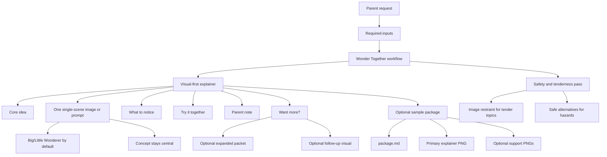

# What The Wonder Together Skill Produces

Wonder Together is an instruction-only Agent Skill. In normal use, it produces a
compact, parent-facing visual explainer in Markdown inside the assistant
response. The first and most important artifact is one single-scene explainer
image, or one polished image prompt when image generation is unavailable.

It does not currently run a hosted generator, call a Wonder Together backend,
store conversations, create private links, or emit a site preview JSON fixture by
default.

## Output Map



## Inputs

A full visual explainer needs:

- the child's question or topic
- the child's age
- the child's name, only if the parent wants personalization
- parent context that changes the answer, when available

If the question or age is missing, the skill should ask for it before producing
the visual explainer. If the request already includes enough context, the skill
should produce the explainer immediately.

## Default Output

The default output is a short Markdown card for the grownup:

```markdown
# Wonder Together Visual Explainer

## Core idea

## Explainer image

## What to notice

## Try it together

## Parent note

## Want more?
```

The explainer is parent-mediated. It should give the grownup one image to show or
generate, a few details to point out, and one small thing to try with the child.
The default image should feel like one refined scene with light diagram cues, not
a numbered multi-panel worksheet or mini packet. The response should not include
a full story, long explanation, mini game, or multi-section packet unless the
user asks for more.

## Visual Outputs

For ordinary science, nature, history, body, geography, pretend-play, or game
material, the `Explainer image` section should provide or generate exactly one
image.

It should include:

- the strongest single-scene visual form for the question: a diagrammed everyday
  moment, comparison, map, timeline, body map, object reference, activity setup,
  or parent-child scene
- Big Wonderer and Little Wonderer as the default parent-child anchor when they
  help the image
- the real concept as the main subject
- short in-image labels, arrows, sightlines, or motion cues only when they make
  that one scene clearer

The skill should favor explainer images over covers, posters, title cards,
worksheets, or generic brand art. Parent notes and extra follow-up prompts stay
outside the image. Avoid numbered panels, storyboards, before/after boards, or
multiple separate ideas by default.

## Tender And Hazard Topics

For tender topics such as death, grief, illness, fear, bodies, identity, or
conflict, the skill should stay direct, gentle, and parent-facing. It should not
force games, cheerful endings, or character scenes.

Tender-topic visual output is usually either:

- no generated image, or
- one optional symbolic prompt, such as a quiet memory box, a tree through
  seasons, or a grownup holding a child's hand

For hazards such as electricity, fire, chemicals, choking risks, sharp tools,
heights, roads, or water, the skill should avoid real-world testing. It should
use drawings, pretend paths, adult-only context, conversation, or other safe
alternatives.

## Expansion Output

The old fuller packet is now an expansion path. If the user asks for more, the
skill can expand the same core idea into:

- a read-aloud story
- a longer explanation
- more visual prompts
- a parent-led activity or mini game
- parent notes
- follow-up questions

## Sample Package Output

When the work is a demo or sample package, the skill output can be collected into
a folder like `samples/moon-following-car/`.

A sample package can include:

- `package.md`: visual explainer, image prompts, review notes, and limitations
- a primary explainer image
- optional support images, such as a character reference, story scene, or
  activity visual

The current moon sample keeps the full demo asset set, but
`moon-parallax-explainer.png` is the primary deliverable.
